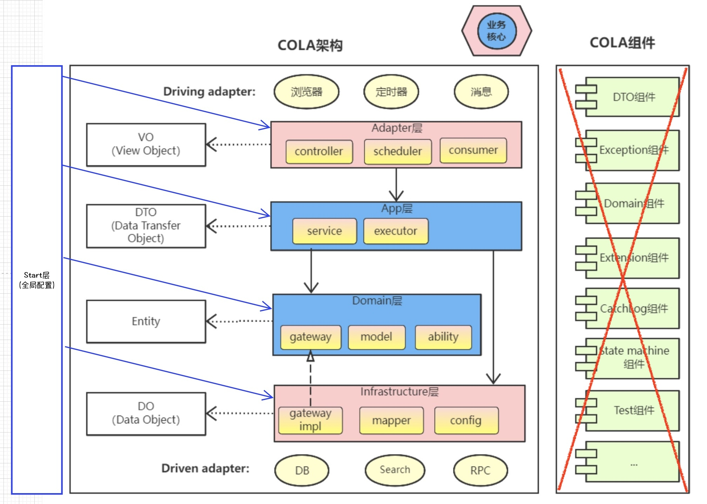
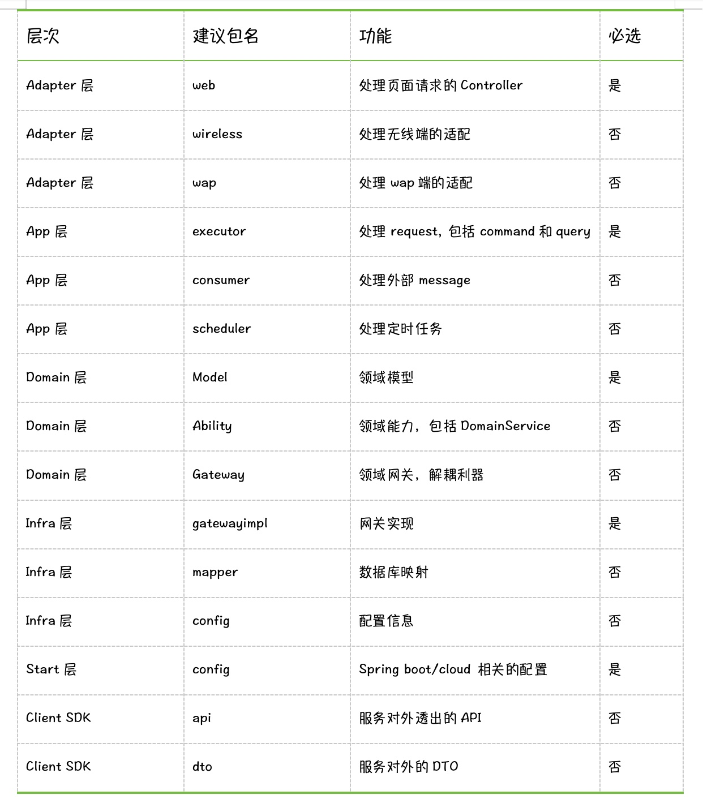

# 脚手架设计宗旨和目标
**宗旨**：遵循微服务理念，以高内聚低耦合为目标，单个服务（即：git工程）体积保持精简（即：高内聚），利用成熟微服务框架（spring cloud）实现服务管理和通信（即：低耦合）    
**最终目标**：通过基于脚手架编程的方式，提高团队的开发效率（质量+速度）  
**实现方式**：本脚手架引入 [COLA](https://github.com/alibaba/COLA) 层次结构来组织代码，同时引入 [Spring Modulith](https://spring.io/projects/spring-modulith/) 来管理模块间的引用。  

# 工程初始化
```bash
# 运行如下命令，clone 代码并初始化工程依赖
# 1. clone代码，也可以直接下载zip包到本地
git clone git@gitee.com:justinjiangcode/spring_boot_modulith.git
cd spring_boot_modulith
# 2. 安装『规范检测插件』依赖
./mvnw install:install-file -Dfile=./libs/p3c-pmd-plus-0.0.1-SNAPSHOT.jar -DgroupId=com.nuoson -DartifactId=p3c-pmd-plus -Dversion=0.0.1-SNAPSHOT -Dpackaging=jar
```

# 代码组织架构
 [COLA 4.0](https://github.com/alibaba/COLA) + [Spring Modulith](https://spring.io/projects/spring-modulith/)  
* 模块设计和依赖关系，借鉴 COLA 4.0 的层次结构，并结合 Spring Boot 的全局配置需求，引入 **Start** 层  
* 微服务 + Spring Modulith 设计，保证微服务逻辑的高内聚和小规模，所以暂未使用COLA的组件概念，既是为了保持微服务的小规模，也为了保证依赖层次关系的简单清晰（组件的依赖关系破坏了层次关系），将组件概念统一使用二方库或三方库的概念处理。同时利用 Spring Modulith 对于代码结构的验证能力，用于保证代码遵循 COLA 中定义的依赖关系      



# 文件/文件夹命名规范约定
| 关键词           | 类型   | 释义                                                                                                                                                |
|------------------|--------|-----------------------------------------------------------------------------------------------------------------------------------------------------|
| internal         | 文件夹 | 模块下的子文件夹，但不是一个子模块（即不包含 package-info.java），文件夹中对象只能被当前子模块引，**<u>_注：此文件夹，不受模块文件夹层次约束_</u>** |
| XXXmodel         | 文件夹 | 业务模块数据类型定义，用于存放当前功能的需要暴露给外部模块的数据定义，例如： Query, Command, DTO, DO                                                |
| XXXservice       | 文件夹 | XXXservice 用于存放当前功能的需要暴露给外部模块的逻辑实现，例如： XXXExecutor, XXXDomainService                                                     |
| XXXExecutor      | 文件   | Executor 后缀，app 层执行器后缀                                                                                                                     |
| XXXDomainService | 文件   | DomainService 后缀，用于 domain层域服务文件的后缀                                                                                                   |
| XXXEntity        | 文件   | Entity 后缀，用于 domain 层域对象文件的后缀                                                                                                         |
| XXXGateway       | 文件   | Gateway 后缀，用于domain 层对于 Infra 层服务的接口定义文件的后缀                                                                                    |


# 模块内文件夹结构
文件架构采用两次划分的方式，第一层划分为功能划分，遵循 COLA 4.0 的结构设计，第二层划分为业务划分，遵循 Spring Modulith 的结构设计，严格控制文件夹嵌套深度不超过两层。具体如下：  
* 第一层（功能模块）结合 COLA 4.0的结构设计，包含如下功能模块：adapter, app, domain, infra, start(针对spring boot/cloud的全局配置)
* 第二层（业务模块）结合 Spring Modulith 的结构设计，按照业务功能划分，**业务模块划分要求粒度足够细，模块内不要再嵌套 *<业务>* 级子模块**  
* 一些约定  
   * 只有包含 package-info.java 文件的文件夹才被认为是一个**模块**
   * 业务模块划分样例和约定
      * foundation 业务模块 -- 基础功能业务模块，用于存放非用户直接需求的基础功能或者当前规模没必要划分出来子模块的功能，例如：登录  
      * XXXmodel 和 XXXservice 业务模块 -- 当业务逻辑过于复杂时（即代码文件过多）时，可以把业务模块拆分为 XXXmodel 和 XXXservice 业务模块
      * 工程初期，代码量较少时， XXXDTO, XXXExecutor 和 XXXDomainService 可以放到功能模块的根目录，后期可以根据业务模块进行划分  

``` text
□ spring_boot_modulith
└─ □ src/main/java
   ├─ □ adapter         
   │  └─ …
   ├─ □ app  
   │  └─ …       
   ├─ □ domain                                  <1>
   │  └─ □ inventory                            <2>
   |     └─ package-info.java                   <3>
   │     └─ InventoryRepositoryGateway.java     <4>   
   │  └─ □ inventorymodel                       <5>
         └─ InventoryEntity.java                <6>
   ├─ □ infra                                   <7> 
   │  └─ internal                               <8> 
   |  └─ □ inventory                              
   │     └─ InventoryRepositoryGatewayImpl.java 
   |     └─ package-info.java 
   │  └─ package-info.java                        
   ├─ □ start                                   <9>
   │  └─ …       
   ├─ Application.java                          <10>  
   
<1> -- 首层功能模块 -- domain（模块需要包含 package-info.java）
<2> -- 第二层业务子模块（模块需要包含 package-info.java）
<3> -- 功能描述及依赖关系描述（当模块引用的其他模块在此定义，如果没有定义就引用，会在模块验证过程中报错） 
<4> -- 模块对外暴露的接口，提供给其他模块引用
<5>, <6> -- 业务 Model 模块和 Model 定义类  
<7> -- infra 功能层
<8> -- 模块内部逻辑（不是模块，不需包含 package-info.java）  
<9> -- start 模块（用于完成 Spring Boot/Cloud 等全局配置，例如：数据库配置，Redis 配置，全局异常配置等）  
<10> -- 工程启动类   

```

# 代码规范
遵循 [阿里巴巴Java开发手册](./docs/Java开发手册(黄山版).pdf)。 部分规则微调，参见 [custom-p3c-ruleset.xml](./custom-p3c-ruleset.xml) 配置文件


# 代码结构（即模块依赖关系）验证
```bash
./mvnw surefire:test -Dtest=ModulithVerificationTest  
```

# MyBatis Plus 代码生成
```bash
# 生成数据库表（将需要生成的表格名称填入测试用例中）对应的 DO, Mapper, Service, Controller 等代码
# -Dtest 参数格式 -- 文件名 或 文件名#方法名
./mvnw surefire:test -Dtest=MyBatisPlusGenerator

# 生成指定数据库表（将需要生成的表格名称填入测试用例中）对应的 DO, Mapper, Service, Controller 等代码
# -Dtest 参数格式 -- 文件名 或 文件名#方法名
./mvnw surefire:test -Dtest=MyBatisPlusGenerator#generateInventoryFromH2

```

# 代码调试
```bash
# 使用测试环境 Redis 集群
./mvnw spring-boot:run -Dspring-boot.run.jvmArguments="-Xdebug -Xrunjdwp:transport=dt_socket,server=y,suspend=y,address=5005" -Dspring-boot.run.arguments="--spring.profiles.active=dev"

# 使用本地 Redis 集群（ ** 注意修改端口号，密码，确保和本地 redis 匹配 **）
./mvnw spring-boot:run -Dspring-boot.run.jvmArguments="-Xdebug -Xrunjdwp:transport=dt_socket,server=y,suspend=y,address=5005"  -Dspring-boot.run.arguments="--spring.profiles.active=dev --spring.data.redis.cluster.nodes=localhost:7000 --spring.data.redis.password=1q2w3e"
```
# Client SDK 生成与部署
```bash
# 生成 Client SDK  jar 包
./mvnw clean install
# 部署 Client SDK（生成 jar 包，并上传至指定仓库），注： CLIENT_SDK_VERSION 为版本号
CLIENT_SDK_VERSION=1.0.0;./mvnw deploy:deploy-file -DgroupId=com.nuoson.modulith -DartifactId=modulith-client -Dpackaging=jar -DrepositoryId=<依赖库Id> -Durl=<依赖库Url> -DgeneratePom=false -Dversion=${CLIENT_SDK_VERSION}-SNAPSHOT -Dfile=target/client/modulith-${CLIENT_SDK_VERSION}-client.jar
```
# 启动时指定 skywalking Agent
```bash
java -Xdebug -Xrunjdwp:transport=dt_socket,server=y,suspend=y,address=5005 -javaagent:<skywalking-agent.jar 地址> -Dskywalking.collector.backend_service=127.0.0.1:11800 -jar target/modulith-1.0.0.jar --spring.profiles.active=dev --server.port=8686
```
*** 开发环境配置参见文件 [README_ENV.md](./README_ENV.md) ***
