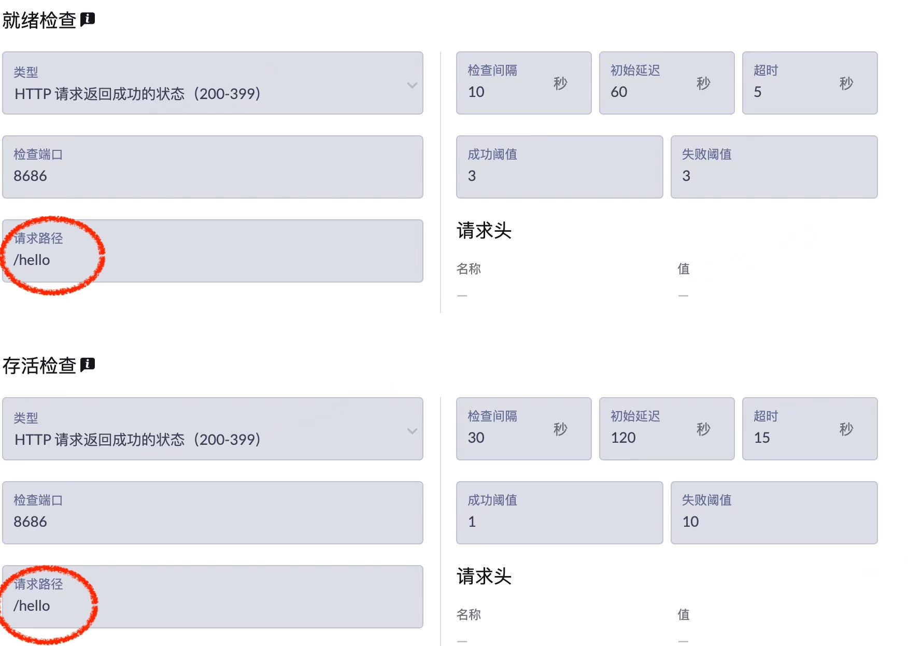
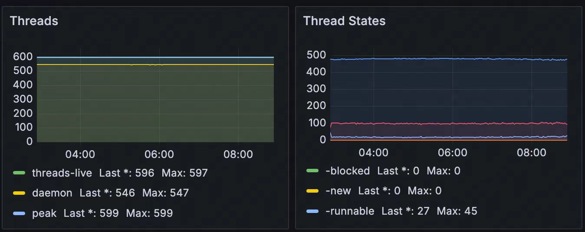

## 背景
pod 内存泄漏（OOM）

## 发现的问题
1. 通过 JVM 没有明显异常
1. 运维提醒可能是本地内存泄漏
1. 一些内存泄漏的报警消息，提示 liveness 侦测超时，所以顺手调整了 pod readiness 和 liveness 的配置




## 调查问题 -- Native Memory Track(NMT)
NMT（Native Memory Tracking，本地内存跟踪）是一个用于跟踪和分析JVM进程使用的本地内存的工具。它帮助开发者了解JVM进程除了堆内存之外使用的内存情况，包括但不限于线程栈、类元数据（如方法区或 Metaspace ）、代码缓存、垃圾收集器内部数据结构、缓冲区等。NMT主要用于诊断内存泄漏、优化内存使用以及解决与本地内存相关的性能问题。

### 启用 NMT
* 第一步： 在启动脚本中添加 NMT 启动项
```shell
# --- 下列代码来自 dockerStart.sh 服务启动脚本 ---
# --- 通过环境变量的方式，使得可以通过修改 Pod 的配置就可以实现部署的改变 ---

# 优化点1 -- 留给 Pod 除 java 以外的更多内存
if [[ -z "${RAM_PERCENTAGE}" ]]; then
    # 默认内存占比（相对于 pod 容器的 memory limit 设置）
    RAM_PERCENTAGE=70
fi
# 优化点2 -- 启用 NMT
JVM_MEMORY="-XX:+UseContainerSupport -XX:MaxRAMPercentage=${RAM_PERCENTAGE} -XX:InitialRAMPercentage=${RAM_PERCENTAGE} -XX:-UseAdaptiveSizePolicy  -XX:MetaspaceSize=512m -XX:MaxMetaspaceSize=512m"
if [[ -n "${ENABLE_NMT}" ]]; then
    # 支持打开 NMT, 此参数的值为： summary or detail
    JVM_MEMORY="${JVM_MEMORY} -XX:NativeMemoryTracking=${ENABLE_NMT}"
fi
```
* 第二步：在代码中获取 NMT 的输出信息
```java
String pid = ManagementFactory.getRuntimeMXBean().getName().split("@")[0];
ProcessBuilder processBuilder = new ProcessBuilder("jcmd", pid, "VM.native_memory", this.trackingLevel);
log.debug("executing cmd: {}", String.join(",", processBuilder.command()));
Process process = processBuilder.start();
BufferedReader reader = new BufferedReader(new InputStreamReader(process.getInputStream()));
String line;
StringBuilder data = new StringBuilder();
// 过滤掉不相关的输出
boolean nmtStartToOutput = false;
while ((line = reader.readLine()) != null) {
    if (!nmtStartToOutput && line.contains("Native Memory Tracking:")) {
        nmtStartToOutput = true;
    }
    if (!nmtStartToOutput) {
        continue;
    }
    data.append(line).append("\r\n");
}
int exitCode = process.waitFor();
log.info("NMT -- {}", data.toString());
```
同时引入 Xxl-job 作为任务调度框架，可以灵活的控制 NMT 的执行与否或频率

* 第三步：打开 Tomcat 的线程池监控
添加配置项
```properties
# 打开 tomcat.threads.* 指标
server.tomcat.mbeanregistry.enabled=true
```
在代码中获取 tomcat 线程池状态
```java
// 使用 io.micrometer.core.instrument.MeterRegistry 获取 Tomcat Thread 状态
log.info("{}:{}, {}:{}",
METRIC_TOMCAT_THREADS_BUSY,
meterRegistry.get(METRIC_TOMCAT_THREADS_BUSY).gauge().value(),
METRIC_TOMCAT_THREADS_MAX,
meterRegistry.get(METRIC_TOMCAT_THREADS_MAX).gauge().value());
```

* 第四步：查看输出结果
```
Total: reserved=2578163KB, committed=1787991KB
-                 Java Heap (reserved=1468416KB, committed=1468416KB)
                            (mmap: reserved=1468416KB, committed=1468416KB) 
 
-                     Class (reserved=619568KB, committed=118320KB)
                            (classes #21372)
                            (  instance classes #19943, array classes #1429)
                            (malloc=3120KB #49281) 
                            (mmap: reserved=616448KB, committed=115200KB) 
                            (  Metadata:   )
                            (    reserved=100352KB, committed=100096KB)
                            (    used=98491KB)
                            (    free=1605KB)
                            (    waste=0KB =0.00%)
                            (  Class space:)
                            (    reserved=516096KB, committed=15104KB)
                            (    used=14149KB)
                            (    free=955KB)
                            (    waste=0KB =0.00%)
 
-                    Thread (reserved=76266KB, committed=7290KB)
                            (thread #75)
                            (stack: reserved=75912KB, committed=6936KB)
                            (malloc=268KB #452) 
                            (arena=86KB #148)
-                      Code (reserved=249924KB, committed=29976KB)
                            (malloc=2236KB #10429) 
                            (mmap: reserved=247688KB, committed=27740KB) 
 
-                        GC (reserved=109866KB, committed=109866KB)
                            (malloc=22234KB #21088) 
                            (mmap: reserved=87632KB, committed=87632KB) 
 
-                  Compiler (reserved=414KB, committed=414KB)
                            (malloc=281KB #1139) 
                            (arena=133KB #5)
 
-                  Internal (reserved=746KB, committed=746KB)
                            (malloc=714KB #2367) 
                            (mmap: reserved=32KB, committed=32KB) 
 
-                     Other (reserved=16546KB, committed=16546KB)
                            (malloc=16546KB #25) 
 
-                    Symbol (reserved=27632KB, committed=27632KB)
                            (malloc=24203KB #298912) 
                            (arena=3428KB #1)
-    Native Memory Tracking (reserved=6117KB, committed=6117KB)
                            (malloc=20KB #258) 
                            (tracking overhead=6097KB)
 
-               Arena Chunk (reserved=2065KB, committed=2065KB)
                            (malloc=2065KB) 
 
-                   Logging (reserved=5KB, committed=5KB)
                            (malloc=5KB #201) 
 
-                 Arguments (reserved=18KB, committed=18KB)
                            (malloc=18KB #492) 
 
-                    Module (reserved=313KB, committed=313KB)
                            (malloc=313KB #3030) 
 
-              Synchronizer (reserved=259KB, committed=259KB)
                            (malloc=259KB #2188) 
 
-                 Safepoint (reserved=8KB, committed=8KB)
                            (mmap: reserved=8KB, committed=8KB) 
```
查看线程池


* 第五步： 优化线程池配置

优化前
```java
List<AsrUrlConfig> asrUrlConfigList = asrUrlConfigDao.list();
// !!!! for 循环，创建了几十个线程池
for(AsrUrlConfig asrUrlConfig : asrUrlConfigList) {
    String lang = asrUrlConfig.getLan();
    YOUDAO_URL_MAP.put(lang, asrUrlConfig);
    HystrixCommand.Setter youdaoSetter = HystrixCommand.Setter.
            withGroupKey(HystrixCommandGroupKey.Factory.asKey(lang + "AsrServiceGroup"))
            .andThreadPoolKey(HystrixThreadPoolKey.Factory.asKey(lang + "YoudaoAsrThreadPool"))
            .andCommandPropertiesDefaults(HystrixCommandProperties.Setter()
                    .withExecutionTimeoutInMilliseconds(Constants.TIME_OUT))
            .andThreadPoolPropertiesDefaults(HystrixThreadPoolProperties.Setter()
                    .withCoreSize(100)
                    .withMaxQueueSize(80)
                    .withQueueSizeRejectionThreshold(80));
    LAN_SETTER_MAP.put(asrUrlConfig.getLan(), youdaoSetter);
}
```
优化后
```java
// 和 tomcat 默认的 server.tomcat.max-threads 保持一直
int maxThreadSize = 200;
defaultHystrixSetter = HystrixCommand.Setter
        .withGroupKey(HystrixCommandGroupKey.Factory.asKey("default"))
        .andThreadPoolKey(HystrixThreadPoolKey.Factory.asKey("default"))
        .andCommandPropertiesDefaults(HystrixCommandProperties.Setter()
                .withExecutionTimeoutInMilliseconds(Constants.TIME_OUT))
        .andThreadPoolPropertiesDefaults(HystrixThreadPoolProperties.Setter()
                .withAllowMaximumSizeToDivergeFromCoreSize(true)
                .withCoreSize(maxThreadSize / 10)
                .withKeepAliveTimeMinutes(10)
                .withMaximumSize(maxThreadSize)
                .withMaxQueueSize(maxThreadSize * 2)
                .withQueueSizeRejectionThreshold(maxThreadSize * 2));
```


## 待优化（方案验证结束后）
1. maxThreadSize, maxCoreSize 等参数可配置，避免只能通过上线才能调整
1. NMT 数据上报 Graphite 监控
1. maxQueueSize 如何设置


## 方案普适性的验证
目标：vivo的图片翻译
特点：只有 vivo 的图片翻译有内存溢出，而 vivo 比线上的 PaaS 服务多了长图调用


